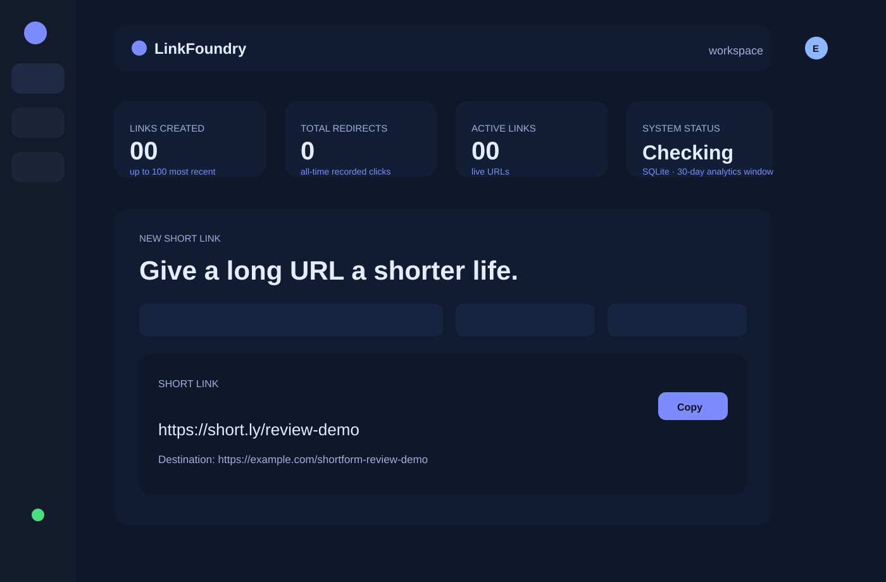
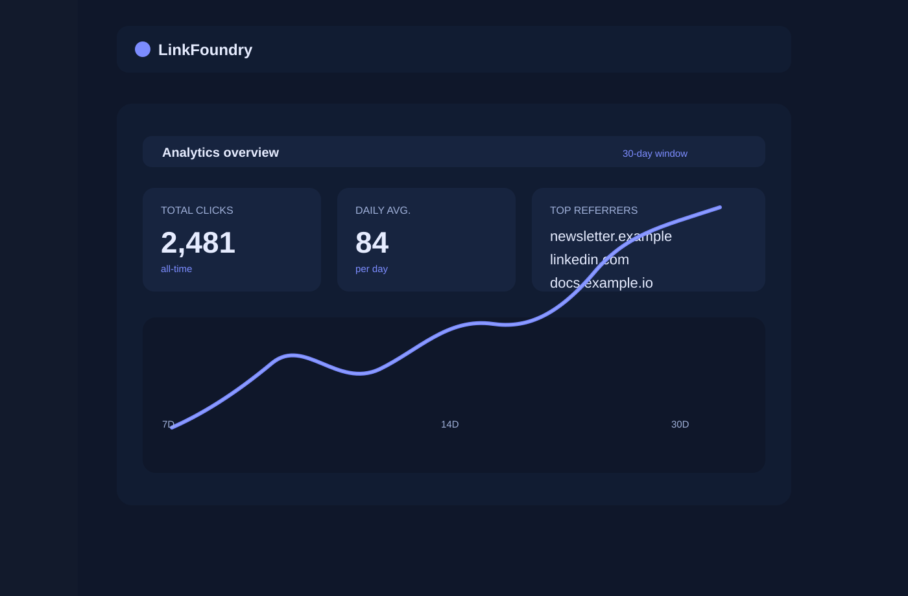

# LinkFoundry Engineering Assessment

LinkFoundry is a production-oriented URL-shortener prototype demonstrating disciplined AI-assisted engineering rather than a throwaway demo. It shows how an engineer can define the task, constrain the AI, review generated output, reject weak assumptions, validate against real tests, document the residual risks, and keep the prototype honest about what is and is not production-ready.

## What this project demonstrates

- Requirement normalization and scoped task decomposition.
- AI-assisted implementation with human review and explicit acceptance or rejection decisions.
- Brownfield-style enhancement reasoning, ambiguity handling, and risk trade-offs.
- .NET and React validation with migration and CI-based quality gates.
- Security-conscious defaults, explicit limitations, and a documented production evolution path.

## Repository evidence map

| Area | Evidence |
| --- | --- |
| AI-assisted engineering model | [docs/AI_ENGINEERING.md](docs/AI_ENGINEERING.md) |
| Scenario-driven requirement handling | [docs/SCENARIOS.md](docs/SCENARIOS.md) |
| Requirement traceability | [docs/REQUIREMENTS_TRACEABILITY.md](docs/REQUIREMENTS_TRACEABILITY.md) |
| Architecture and product context | [docs/ARCHITECTURE.md](docs/ARCHITECTURE.md) |
| Threat model and control coverage | [docs/THREAT_MODEL.md](docs/THREAT_MODEL.md) |
| Failure-mode validation | [docs/FAILURE_TESTS.md](docs/FAILURE_TESTS.md) |
| AI decision log | [docs/AI_DECISION_LOG.md](docs/AI_DECISION_LOG.md) |
| Final engineering summary | [docs/FINAL_ENGINEERING_SUMMARY.md](docs/FINAL_ENGINEERING_SUMMARY.md) |

## Features

- Create short links with optional custom codes and expiry dates.
- Monitor redirect totals, daily click patterns, and top referrers.
- Deactivate links safely when they are no longer valid.
- Enforce HTTP(S) destination validation and route protections.
- Secure the management API with OIDC JWT validation and required scope checks.
- Provide a reviewable engineering record for AI-assisted development decisions.

## Tech stack

- React + TypeScript frontend
- ASP.NET Core minimal API
- EF Core + SQLite for local persistence and migration-based schema control
- OIDC / PKCE SPA authentication flow
- CI workflow for restore, tests, lint, build, and dependency audit

## Deployment status

This repository is prepared for a simple Render deployment, and the deployment configuration is included in [render.yaml](render.yaml). The public hostname is assigned by Render after the first successful deployment, so this workspace does not claim a live production URL without a cloud account and deployment credentials attached.

Expected service names after deployment:

- Frontend: `https://linkfoundry-web.onrender.com`
- API: `https://linkfoundry-api.onrender.com`

These values are the standard Render hostnames for the configured services and should be updated to the actual generated URLs once the app is connected to the hosting account. The repo is ready for a hosted demo, but the actual public URL must be created from the Render console or a valid cloud provider configuration.

### Render setup

1. Connect the GitHub repository to Render.
2. Render reads [render.yaml](render.yaml) and creates the API web service, SQLite database, and the frontend static site.
3. Set the OIDC values in the Render dashboard for `Authentication__Authority`, `Authentication__Audience`, and `Authentication__RequiredScope` if you enable protected management routes.
4. After deployment, verify the frontend loads, the API health endpoint returns `200`, and the redirect flow works from the generated public URL.

## Site preview

### Dashboard overview



### Analytics view



## Run locally

Prerequisites: .NET 8 SDK and Node.js 20.19+ (or 22.12+) with npm. The supported Node version is pinned in `.nvmrc`. CI runs ESLint 10 and Vite 7 using Node 22.14.

From PowerShell:

```powershell
cd "$env:USERPROFILE\Downloads\LinkFoundry"
dotnet test LinkFoundry.sln
```

Start the API in one terminal:

```powershell
dotnet run --project src/Shortener.Api --launch-profile http
```

Start the React application in another terminal:

```powershell
cd web
npm ci
npm run dev
```

Open <http://localhost:5173>. The API listens on <http://localhost:5080>; interactive Swagger is at <http://localhost:5080/swagger>. `/health/live` reports process liveness; `/health/ready` and `/health` report database readiness (`503` until migrations are current).

SQLite creates `linkfoundry.db` in the API working directory and applies migrations automatically only in Development. Set `ConnectionStrings__Shortener`, `PublicBaseUrl`, `WebOrigin`, and `ASPNETCORE_ALLOWEDHOSTS` to override defaults. Production also requires `Authentication__Authority`, `Authentication__Audience`, and `Authentication__RequiredScope`; management routes fail closed without them. The SPA production build requires `VITE_AUTH_REQUIRED=true`, `VITE_OIDC_AUTHORITY`, `VITE_OIDC_CLIENT_ID`, `VITE_OIDC_SCOPE`, and `VITE_API_BASE_URL`. Register the exact SPA URL ending in `/auth/callback` and the post-logout origin with your identity provider, and ensure its access token contains the exact scope configured in `Authentication__RequiredScope`. Never put client secrets in the SPA. `web/.env.example` shows the names; deployment values belong in the approved secret/configuration system.

The default launch profile sets `ASPNETCORE_ENVIRONMENT=Development`; this enables anonymous local operator APIs and runs migrations at startup. That mode is for a developer's local loop only and must not be exposed to an untrusted network. Production does not run schema DDL during API startup. Build a reviewed migration bundle and apply it as an explicit deployment step after taking a database backup:

```powershell
dotnet tool restore
dotnet ef migrations bundle --project src/Shortener.Infrastructure/Shortener.Infrastructure.csproj --startup-project src/Shortener.Api/Shortener.Api.csproj --context ShortenerDbContext --configuration Release --output artifacts/linkfoundry-efbundle
& "artifacts/linkfoundry-efbundle.exe" --connection "$env:ConnectionStrings__Shortener"
```

- List the latest 100 links, inspect all-time click totals and 30-day daily/referrer analytics, and deactivate a link.
- Rate limit link creation to 20 requests per minute per process/IP; validate destination protocol, embedded credentials, and custom-code shape.
- Production API access uses OIDC JWT bearer validation plus a required management scope; the SPA uses Authorization Code with PKCE and session-scoped user state.
- Run service tests and HTTP integration tests using a temporary SQLite database.

## API overview

| Method | Route | Result |
| --- | --- | --- |
| `GET` | `/health/live` | Process liveness |
| `GET` | `/health/ready` or `/health` | Database connectivity and migration readiness |
| `POST` | `/api/links` | Create link; `201`, `400`, `409`, or `429` |
| `GET` | `/api/links` | Up to 100 newest link summaries |
| `GET` | `/api/links/{code}` | Summary, daily clicks, and top referrers |
| `DELETE` | `/api/links/{code}` | Deactivate; `204` or `404` |
| `GET` | `/{code}` | Record a click and issue a `302`, or `404` |

Create request:

```json
{
  "destinationUrl": "https://example.com/engineering",
  "customCode": "engineering",
  "expiresAt": null
}
```

## Quality checks

```powershell
dotnet test LinkFoundry.sln
cd web
npm run build
npm run lint
npm audit
```

The workflow in `.github/workflows/quality.yml` repeats locked .NET restore/tests, migration bundle generation, frontend `npm ci`, lint/build, and full npm audit on pushes and pull requests. Production use still requires a real OIDC registration, durable managed database and tested backups, trusted proxy/IP configuration, distributed rate limiting, abuse and bot controls, retention/privacy decisions, telemetry/alerts, load/failure tests, and security/privacy/operations sign-off. SQLite and synchronous click writes are for the reviewable prototype, not horizontally scaled service deployment. “Production-grade” here means production-oriented controls and an auditable release path; it is not a production deployment certification.

## Engineering evidence and review

This project is intentionally explicit about what is implemented, what is intentionally not included, and what would need a production review gate before exposing the service publicly. The repository includes a complete evidence trail for requirement understanding, ambiguity handling, AI-assisted decision-making, validation, and residual risk.